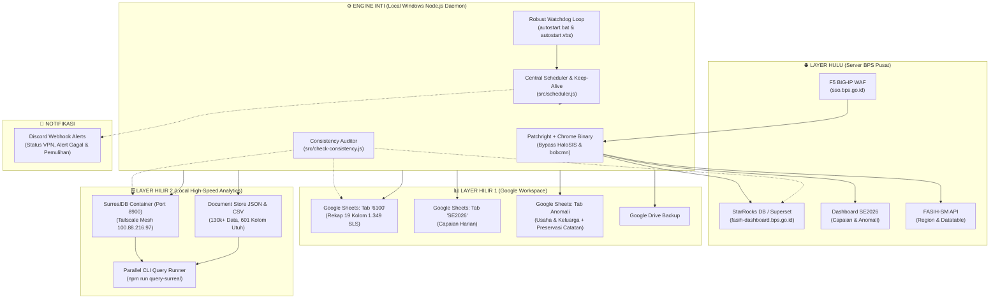

# 🛰️ Fasih Sync Monitoring & Analytics (SE2026)

[](https://nodejs.org/)
[](https://surrealdb.com/)
[](https://github.com/Kaliiiiiiiiii-Venyx/patchright)
[](https://microsoft.com/windows)
[]()

Sistem otomasi terpadu untuk pemantauan operasional, crawling berkinerja tinggi, sinkronisasi multi-layer hulu-hilir, dan data store analitik lokal kegiatan **Sensus Ekonomi 2026 (SE2026)** BPS Kabupaten Mempawah (`6104`) dan Provinsi Kalimantan Barat (`6100`).

---

## 📌 Daftar Isi
1. [Konteks & Nilai Proyek (30-Second Overview)](#-konteks--nilai-proyek-30-second-overview)
2. [Arsitektur Aliran Data (Hulu ke Hilir)](#-arsitektur-aliran-data-hulu-ke-hilir)
3. [🚨 Aturan Emas: Batasan Kuota StarRocks (300 Req/Hari)](#--aturan-emas-batasan-kuota-starrocks-300-reqhari)
4. [Prasyarat Sistem & Pre-flight Diagnostic Check](#-prasyarat-sistem--pre-flight-diagnostic-check)
5. [Quickstart: Onboarding Developer Baru (< 60 Detik)](#-quickstart-onboarding-developer-baru--60-detik)
6. [Konfigurasi Lingkungan (.env)](#-konfigurasi-lingkungan-env)
7. [Detail 5 Pipeline Operasional Utama](#-detail-5-pipeline-operasional-utama)
8. [Panduan Eksplorasi Data Offline (SurrealDB CLI)](#-panduan-eksplorasi-data-offline-surrealdb-cli)
9. [Akses Server SurrealDB Multi-Perangkat (LAN & Tailscale)](#-akses-server-surrealdb-multi-perangkat-lan--tailscale)
10. [Audit Konsistensi & Health Check Harian](#-audit-konsistensi--health-check-harian)
11. [Daftar Referensi Perintah CLI (NPM Scripts)](#-daftar-referensi-perintah-cli-npm-scripts)
12. [Troubleshooting & Solusi Error Umum](#-troubleshooting--solusi-error-umum)
13. [Struktur Direktori Repositori](#-struktur-direktori-repositori)

---

## ⚡ Konteks & Nilai Proyek (30-Second Overview)

Dalam operasional lapangan SE2026, petugas dan pimpinan membutuhkan pemantauan progres yang cepat dan akurat. Namun, sistem hulu menghadapi kendala teknis nyata:
* **F5 BIG-IP WAF (HaloSIS) Anti-Bot:** Portal SSO BPS dan FASIH memblokir browser headless standar secara agresif.
* **Limitasi Kuota Hulu:** Server Superset SQL Lab BPS Pusat memberlakukan batasan keras **maksimal 300 kueri per hari per akun**.
* **Limitasi Paginasi StarRocks:** Setiap kueri SQL Lab dibatasi maksimal 9.000 baris, padahal Mempawah memiliki **130.000+ baris penugasan** dengan skema **601 kolom**.
* **Pencegahan Data Timpa di Google Sheets:** Pengawas mengisi catatan tindak lanjut manual di spreadsheet yang tidak boleh terhapus saat data baru disinkronkan.

**Solusi Proyek Ini:**  
Menyediakan daemon latar belakang 24/7 di Windows yang melakukan sinkronisasi berkala terjadwal, menyimpan snapshot penuh 601 kolom ke database lokal berkecepatan tinggi (**SurrealDB**), memperbarui Google Sheets pimpinan tanpa menimpa catatan manual, serta menyediakan CLI kueri offline instan tanpa mengonsumsi kuota server pusat.

---

## 🏗️ Arsitektur Aliran Data (Hulu ke Hilir)



---

## 🚨 ⛔ ATURAN EMAS: BATASAN KUOTA STARROCKS (300 REQ/HARI)

> [!CAUTION]
> **PERINGATAN KUOTA KERAS BPS SUPERSET SQL LAB:**
> 1. Akun SSO BPS hanya memiliki kuota **300 query / request per hari (24 jam)**.
> 2. Jika kuota 300 terlampaui, server akan mengembalikan `HTTP 429 Too Many Requests`.
> 3. Dampak: **Seluruh pipeline sinkronisasi otomatis hulu ke hilir akan lumpuh total** sampai pergantian hari (reset kuota).

### ⛔ Larangan Keras:
* **DILARANG** menjalankan kueri coba-coba (*trial & error*) langsung di browser Superset SQL Lab BPS.
* **DILARANG** mengeksekusi kueri agregasi berat (GROUP BY kecamatan/desa) ke StarRocks secara ad-hoc.
* **DILARANG** membuat script looping query baru tanpa memperhitungkan anggaran kuota.

### 🛡️ Solusi Tepat: Eksplorasi 100% di SurrealDB Lokal
Semua data 130.000+ penugasan beserta 601 kolom telah tersimpan lengkap di lokal. Gunakan:
```powershell
npm run query-surreal -- "<QUERY_SURREALQL_ATAU_FILTER>"
```
* **0 Konsumsi Kuota:** Sebanyak apa pun Anda mengeksekusi kueri, sisa kuota StarRocks tetap utuh.
* **Performa Sub-Detik:** Query dieksekusi in-memory dengan worker threads paralel.

### 📊 Alokasi Anggaran Kuota Harian Resmi Scheduler:
| Pipeline | Frekuensi | Request / Run | Total / Hari | Keterangan |
| :--- | :--- | :--- | :--- | :--- |
| **Sync Progres SLS (Tab `6100`)** | Tiap jam (menit :00) | 1 req | **24 req** | Rekap 19 kolom 1.349 SLS Mempawah |
| **SurrealDB Delta Sync** | Tiap jam (menit :30) | 1 - 2 req | **24 - 48 req** | Checkpoint rollover incremental |
| **Sync Capaian & Anomali SE2026** | 1x sehari (06:05 WIB) | 1 req | **1 req** | Via Fasih Dashboard |
| **Keep-Alive Ping (Anti-Idle)** | Tiap 3 menit | 0 req SQL | **0 req** | Hanya HEAD request ringan HTTP |
| **TOTAL PENGGUNAAN RUTIN** | - | - | **~50 - 75 req** | **Hanya ~25% dari total kuota 300!** |
| **BUFFER KEAMANAN RESMI** | - | - | **~225 req** | **Cadangan aman untuk retry & audit** |

---

## 💻 Prasyarat Sistem & Pre-flight Diagnostic Check

### Matriks Kompatibilitas Lingkungan
| Komponen | Spesifikasi Minimum | Rekomendasi | Catatan Kritis |
| :--- | :--- | :--- | :--- |
| **Sistem Operasi** | Windows 10 x64 | Windows 11 Pro x64 | Autostart watchdog menggunakan Batch & VBScript native Windows. |
| **Node.js** | v18.0.0 LTS | v20.x atau v22.x LTS | Diperlukan untuk modul ES (`"type": "module"`) & Worker Threads. |
| **Google Chrome** | v120+ | Versi Resmi Terbaru | Wajib terpasang di `C:\Program Files\Google\Chrome\Application\chrome.exe`. |
| **Docker Desktop** | v4.x | Versi Terbaru | Untuk menjalankan container image `surrealdb/surrealdb:latest`. |
| **Jaringan / VPN** | Koneksi Internet | FortiClient VPN BPS | Intranet BPS (`fasih-sm.bps.go.id`, `sso.bps.go.id`) wajib via VPN BPS. |
| **IAM Kredensial** | Akun SSO BPS Aktif | Service Account GCP | File `cerdas-*.json` dengan peran Editor pada Google Sheets. |

### 🔍 Pre-flight Diagnostic Check (Uji Mandiri 1 Baris)
Buka PowerShell dan jalankan perintah berikut untuk memastikan komputer Anda siap sebelum instalasi:
```powershell
node -v; docker -v; Test-Path "C:\Program Files\Google\Chrome\Application\chrome.exe"
```
> **Hasil yang Diharapkan:** Versi node (e.g. `v20.x.x`), versi Docker, dan nilai `True`.

---

## 🚀 Quickstart: Onboarding Developer Baru (< 60 Detik)

Ikuti 4 langkah deterministik berikut untuk menjalankan sistem pertama kali:

### Langkah 1: Kloning & Instal Dependensi
```powershell
git clone https://github.com/ipds6104/fasih-sync-monitoring.git
cd fasih-sync-monitoring
npm install
```

### Langkah 2: Siapkan File Konfigurasi `.env`
Salin template `.env.example` ke `.env` dan masukkan kredensial Anda:
```powershell
Copy-Item .env.example .env
```
*(Buka `.env` dan pastikan `FASIH_USERNAME`, `FASIH_PASSWORD`, serta `GOOGLE_APPLICATION_CREDENTIALS` telah diisi)*.

### Langkah 3: Pastikan Container SurrealDB Berjalan
Jika container belum pernah dibuat:
```powershell
docker run -d --name surrealdb -p 8900:8000 --restart always surrealdb/surrealdb:latest start --user root --pass root
```
Jika container sudah ada:
```powershell
docker start surrealdb
```
*Uji kesehatan database:*
```powershell
curl http://127.0.0.1:8900/health
```
*(Respons yang diharapkan: `OK` atau status `200`)*.

### Langkah 4: Sanity Check (Uji Coba Pertama - 0 Risiko Kuota)
Jalankan satu kueri analitik cepat ke data lokal yang ada:
```powershell
npm run query-surreal -- "SELECT count() FROM assignment WHERE is_active = 1"
```
```text
┌─────────┬────────┐
│ (index) │ count  │
├─────────┼────────┤
│    0    │ 129137 │
└─────────┴────────┘
⏱️ [Statistik]: Dipindai: 130,421 baris | Cocok: 1 baris | Durasi: 412ms
```
🎉 **Selamat! Lingkungan lokal Anda telah siap 100%.**

---

## ⚙️ Konfigurasi Lingkungan (.env)

Berikut adalah kamus parameter konfigurasi utama pada berkas [`.env`](file:///c:/projects/fasih-sync-monitoring/.env.example):

| Parameter | Tipe | Wajib? | Nilai Default / Contoh | Deskripsi |
| :--- | :--- | :---: | :--- | :--- |
| `FASIH_USERNAME` | String | **Ya** | `nama_pengguna_sso` | Akun SSO BPS Anda. |
| `FASIH_PASSWORD` | String | **Ya** | `password_sso` | Password SSO BPS Anda. |
| `HEADLESS` | Boolean | Opsional | `true` | `true` = mode hening, `false` = memunculkan jendela Chrome saat login. |
| `KABUPATEN_CODES` | String | Opsional | `04` | Kode Kab/Kota BPS (misal `04` = Mempawah). Kosongkan untuk seluruh kab. |
| `REGION_SUMMARY_LEVEL` | Integer | Opsional | `6` | Level agregasi wilayah: `5` = SLS, `6` = Sub-SLS (16 digit). |
| `SPREADSHEET_ID` | String | **Ya** | `1Jg5DwJU...` | ID Google Spreadsheet utama monitoring SLS. |
| `SPREADSHEET_ANOMALI_ID` | String | **Ya** | `1iK-N0xV...` | ID Google Spreadsheet untuk pelacakan anomali SE2026. |
| `GOOGLE_APPLICATION_CREDENTIALS` | String | **Ya** | `cerdas-*.json` | Path relatif ke berkas kunci Google Cloud Service Account. |
| `SURREAL_URL` | String | Opsional | `http://127.0.0.1:8900/sql`| Endpoint HTTP API database SurrealDB lokal. |
| `SURREAL_NS` & `SURREAL_DB` | String | Opsional | `bps_mempawah`, `se2026` | Namespace dan nama database SurrealDB. |
| `CRON_SQLLAB_SCHEDULE` | String | Opsional | `0 * * * *` | Jadwal sinkronisasi SQL Lab (menit ke-00 tiap jam). |
| `CRON_SURREAL_SCHEDULE` | String | Opsional | `30 * * * *` | Jadwal sinkronisasi delta SurrealDB (menit ke-30 tiap jam). |
| `CRON_DASHBOARD_SCHEDULE` | String | Opsional | `5 6 * * *` | Jadwal sinkronisasi capaian & anomali dashboard (06:05 WIB). |
| `DISCORD_WEBHOOK_URL` | String | Opsional | `https://discord.com/...` | Webhook URL channel Discord untuk pemantauan notifikasi dan alert. |

---

## 🔄 Detail 5 Pipeline Operasional Utama

### 1. Pipeline SQL Lab Progres SLS (Tab `6100` & `Done Listing`)
* **Perintah:** `npm run sync-sqllab`
* **Jadwal Otomatis:** `0 * * * *` (Setiap jam tepat di menit ke-00)
* **Logika:**
  1. Menarik 19 kolom indikator agregat untuk 1.344 SLS Kabupaten Mempawah via StarRocks SQL Lab.
  2. Melakukan *selective merge*: Mempertahankan data 17.997 baris SLS dari 13 kabupaten/kota lain se-Kalimantan Barat agar tidak terhapus.
  3. Mengunggah hasil penggabungan ke Google Sheets Tab `6100` dan memperbarui tab `Done Listing`.

### 2. Pipeline Full-Schema SurrealDB Store (601 Kolom Zero-Pruning)
* **Perintah:** `npm run sync-surreal`
* **Jadwal Otomatis:** `30 * * * *` (Setiap jam di menit ke-30)
* **Logika Menembus Limit 9.000 Baris StarRocks:**
  1. Kueri delta dijalankan berurutan:  
     `SELECT ... FROM base_table_assignment WHERE level_2_full_code = '6104' AND assignment_date_modified > '${lastSyncTime}' ORDER BY assignment_date_modified ASC LIMIT 9000;`
  2. Sengaja **TIDAK menyaring `is_active = 1`** saat penarikan agar perubahan *soft-delete* dari pusat dapat terdeteksi.
  3. Menggunakan teknik **Checkpoint Rollover**: Jika perubahan lebih dari 9.000 data, penarikan dipotong di baris ke-9.000 dan checkpoint di `results/surrealdb_sync_state.json` diperbarui ke timestamp baris tersebut. Pada siklus berikutnya, scheduler otomatis melanjutkan sisa data hingga konvergen sempurna (*zero data loss*).
  4. Data disimpan ke container SurrealDB dan file document store [`results/surrealdb_document_store.json`](file:///c:/projects/fasih-sync-monitoring/results/surrealdb_document_store.json) (1,8 GB) + CSV (674 MB).

### 3. Pipeline Dashboard SE2026 Capaian & Anomali Harian
* **Perintah:** `npm run sync-se2026`
* **Jadwal Otomatis:** `5 6 * * *` (Setiap hari pukul 06:05 WIB)
* **Logika Preservasi Catatan Pengawas:**
  1. Menarik progres harian (Tab `SE2026`), Anomali Usaha (Tab `Anomali Usaha`), dan Anomali Keluarga (Tab `Anomali Keluarga`).
  2. **Preservasi Kolom Manual:** Kolom catatan yang diisi oleh tim lapangan (`Tindak Lanjut Anomali`, `Perbaikan/Catatan di Fasih`, `Keterangan Tindak Lanjut Anomali`) dibaca terlebih dahulu lalu dipetakan kembali ke baris yang sesuai. Catatan pengguna **tidak akan pernah tertimpa**.
  3. Kasus anomali yang sudah diselesaikan dan hilang dari dashboard pusat tetap disimpan di bagian arsip paling bawah spreadsheet.

### 4. Pipeline Audit Konsistensi Multi-Layer 3 Dimensi
* **Perintah:** `npm run check-consistency`
* **Logika:** Mengaudit keselarasan data antara:
  * **Hulu:** Total record aktif di StarRocks SQL Lab.
  * **Hilir 1:** Total agregat di Google Sheets Tab `6100`.
  * **Hilir 2:** Total record aktif di SurrealDB lokal.
* Menghasilkan status visual:
  * 🟢 **`SYNC`**: 100% identik.
  * 🟡 **`DRIFT`**: Selisih wajar akibat pergerakan petugas lapangan real-time.
  * 🔴 **`DESYNC`**: Kesenjangan akibat scheduler mati, memicu saran rekonsiliasi.

### 5. Pipeline Keep-Alive & Robust 24/7 Watchdog (Windows)
* **Perintah Instalasi Autostart:** `npm run install-startup`
* **Arsitektur Ketahanan Tinggi:**
  1. **Loop Watchdog Mandiri ([`autostart.bat`](file:///c:/projects/fasih-sync-monitoring/autostart.bat)):** Menjalankan container SurrealDB dan mengeksekusi `node src/scheduler.js`. Jika proses berhenti atau crash, watchdog otomatis me-restart dalam 10 detik.
  2. **Silent Runner ([`autostart.vbs`](file:///c:/projects/fasih-sync-monitoring/autostart.vbs)):** Menjalankan batch script secara senyap di background tanpa menampilkan jendela hitam CMD.
  3. **Dual Redundancy Autostart:** Terpasang di folder *Windows Startup* dan *Windows Registry Run Key* (`HKCU`).
  4. **Pembersihan Cerdas Stale Lockfile ([`scheduler.lock`](file:///c:/projects/fasih-sync-monitoring/scheduler.lock)):** Memeriksa PID lama menggunakan `tasklist`. Jika PC baru restart dan PID mati, lockfile otomatis dibersihkan tanpa intervensi manual.
  5. **Anti-Idle VPN Keep-Alive:** Melakukan ping ringan (HEAD request) ke `https://fasih-sm.bps.go.id` setiap 3 menit agar sesi FortiClient VPN tidak terputus. Notifikasi Discord otomatis dikirim jika ping gagal 3x berturut-turut.

---

## 🔎 Panduan Eksplorasi Data Offline (SurrealDB CLI)

Alat [`src/query-surreal.js`](file:///c:/projects/fasih-sync-monitoring/src/query-surreal.js) menyediakan mesin kueri SQL/SurrealQL lokal yang dapat membaca langsung dari database SurrealDB atau berkas JSON Document Store menggunakan multi-threading.

### Contoh Kueri Populer:

```powershell
# 1. Rekap Status Penugasan Aktif (Wajib gunakan WHERE is_active = 1 untuk angka resmi)
npm run query-surreal -- "SELECT assignment_status_alias, count() FROM assignment WHERE is_active = 1 GROUP BY assignment_status_alias"

# 2. Filter Penugasan Ditolak Pengawas di Kecamatan Tertentu
npm run query-surreal -- "SELECT id, code_identity, assignment_status_alias, se2026_nama_usaha FROM assignment WHERE assignment_status_alias = 'REJECTED BY Pengawas' AND level_3_name = 'MEMPAWAH HILIR' LIMIT 20"

# 3. Analisis Usaha Keluarga vs Bukan Keluarga
npm run query-surreal -- "SELECT root_jenis_prelist, count() FROM assignment WHERE is_active = 1 GROUP BY root_jenis_prelist"

# 4. Pencarian Usaha Temuan Baru di Lapangan (se2026_keberadaan_usaha_value = '2')
npm run query-surreal -- "SELECT code_identity, se2026_nama_usaha, level_3_name FROM assignment WHERE se2026_keberadaan_usaha_value = '2' LIMIT 50"

# 5. Ekspor Hasil Kueri ke File CSV
npm run query-surreal -- "SELECT id, code_identity, se2026_nama_usaha, level_3_name FROM assignment WHERE level_3_name = 'SUNGAI PINYUH'" --out results/usaha_sungai_pinyuh.csv

# 6. Eksekusi Kueri Multi-Kecamatan Sekaligus Secara Paralel
npm run query-surreal -- --parallel "SELECT count() FROM assignment WHERE level_3_name = 'MEMPAWAH HILIR'" "SELECT count() FROM assignment WHERE level_3_name = 'SUNGAI PINYUH'" "SELECT count() FROM assignment WHERE level_3_name = 'ANJONGAN'"
```

<details>
<summary>💡 <b>Kamus Nilai Kolom Kunci SE2026 (Klik untuk membuka)</b></summary>

*   **Filter Aktif Wajib:** `is_active = 1` (Menyaring data penugasan aktif dan mengecualikan pembatalan/soft-delete).
*   **Status Keberadaan Usaha (`se2026_keberadaan_usaha_value`):**
    *   `1` = Ditemukan (Prelist aktif ada di lapangan)
    *   `2` = Usaha Baru (Temuan baru lapangan)
    *   `0` / `00` = Tidak Ditemukan
    *   `3` = Tutup Permanen
    *   `4` = Ganda / Duplikasi
    *   `9` = Non Respon / Menolak
*   **Identifikasi Usaha Keluarga (`root_jenis_prelist` & `se2026_badan_usaha_value`):**
    *   `root_jenis_prelist = 'keluarga'` $\rightarrow$ Keluarga hasil prelist DTSEN.
    *   `se2026_badan_usaha_value = 13` $\rightarrow$ Bukan Badan Usaha (Usaha perseorangan/keluarga).
</details>

---

## 🌐 Akses Server SurrealDB Multi-Perangkat (LAN & Tailscale)

Selain dapat diakses secara lokal oleh host runner, container SurrealDB pada repositori ini berfungsi sebagai **Central Operational Data Store** berkecepatan tinggi yang dapat diakses langsung oleh perangkat lain (laptop analis, pengawas, atau pengembang lain) tanpa perlu menginstal ulang dataset 2 GB atau menyedot kuota server pusat StarRocks.

### 🔌 Parameter Koneksi Standar
| Parameter | Nilai Standar | Keterangan |
| :--- | :--- | :--- |
| **Host (Localhost)** | `http://127.0.0.1:8900` | Untuk script di PC host utama |
| **Host (Tailscale Mesh)** | `http://100.88.216.97:8900` | Akses jarak jauh via jaringan Tailscale VPN BPS |
| **Host (LAN Kantor)** | `http://<IP_LAN_HOST>:8900` | Akses via Wi-Fi / Ethernet kantor BPS (misal `192.168.x.x`) |
| **Namespace (NS)** | `bps_mempawah` | Ruang nama database SE2026 |
| **Database (DB)** | `se2026` | Database penugasan Mempawah |
| **Authentication** | `root` / `root` | Kredensial dasar HTTP Basic Auth |
| **Target Table** | `assignment` | Tabel utama berisi 130k+ record (601 kolom lengkap) |

---

### 🖥️ 3 Cara Mengakses dari Perangkat Lain

#### 1. Visual Web GUI via Surrealist Studio (Tanpa Install Software — Paling Praktis untuk Laptop Polosan)
Jika laptop kedua adalah laptop polosan (tanpa Node.js/Docker/Git) dan pengawas/analis hanya ingin melihat serta memfilter data:
1. Di laptop kedua, buka browser (Chrome / Edge), kunjungi [**Surrealist Web**](https://surrealist.app/).
2. Klik **Add Connection** $\rightarrow$ pilih tipe koneksi **Remote (RPC or HTTP)**.
3. Masukkan konfigurasi:
   * **Endpoint:** `http://100.88.216.97:8900/rpc` *(via Tailscale)* atau `http://<IP_LAN_HOST>:8900/rpc` *(via Wi-Fi kantor)*
   * **Namespace:** `bps_mempawah`
   * **Database:** `se2026`
   * **Username:** `root`
   * **Password:** `root`
4. Anda dapat melihat struktur tabel `assignment`, menjelajahi data per baris, menjalankan kueri SQL dengan auto-complete, serta mengekspor hasil ke JSON/CSV secara instan.

#### 2. Kueri Remote CLI dari Laptop Kedua (`--remote`)
Jika laptop kedua adalah komputer kerja pengembang:
1. Clone repositori ini di laptop kedua (**laptop kedua TIDAK PERLU Docker dan TIDAK PERLU mendownload data 2 GB**).
2. Buat berkas [`.env`](file:///c:/projects/fasih-sync-monitoring/.env.example) di laptop kedua, **cukup isi 1 baris saja** (tanpa akun SSO BPS atau kunci Google):
   ```env
   SURREAL_URL=http://100.88.216.97:8900/sql
   ```
3. Jalankan kueri dengan flag `--remote`:
   ```powershell
   npm run query-surreal -- --remote "SELECT code_identity, se2026_nama_usaha, assignment_status_alias FROM assignment WHERE is_active = 1 LIMIT 10"
   ```

#### 3. Integrasi Data Science (Python / Pandas / R / cURL)
Statistisi dapat langsung menarik data ke dalam Jupyter Notebook atau script Python tanpa harus mentransfer file CSV berukuran ratusan megabyte:
```python
import requests
import pandas as pd

# Konfigurasi endpoint host
SURREAL_URL = "http://100.88.216.97:8900/sql"
headers = {
    "Accept": "application/json",
    "NS": "bps_mempawah",
    "DB": "se2026"
}
auth = ("root", "root")

# Eksekusi kueri langsung
sql_query = """
SELECT id, code_identity, assignment_status_alias, level_3_name, se2026_nama_usaha
FROM assignment 
WHERE is_active = 1 
LIMIT 5000;
"""

response = requests.post(SURREAL_URL, headers=headers, auth=auth, data=sql_query)
records = response.json()[0]["result"]
df = pd.DataFrame(records)

print(f"Total baris dimuat: {len(df)}")
print(df.head())
```

*Contoh pemanggilan cepat via cURL:*
```bash
curl -X POST http://100.88.216.97:8900/sql \
  -H "NS: bps_mempawah" \
  -H "DB: se2026" \
  -u "root:root" \
  -d "SELECT count() FROM assignment WHERE is_active = 1;"
```

---

### 🔒 Catatan Keamanan, Privasi & Manajemen Akun

> [!NOTE]
> **Apakah Aman Menggunakan Surrealist Studio Web (`surrealist.app`)?**
> * **Zero Cloud Leak (100% Client-Side):** Website `https://surrealist.app` adalah aplikasi *Single Page Application (SPA)* murni yang dieksekusi secara lokal di browser laptop Anda. Kueri dan data sensus **TIDAK PERNAH melewati atau disimpan di server cloud Surrealist**. Browser berkomunikasi langsung ke IP PC host/Tailscale Anda.
> * **Opsi 100% Offline Tanpa Browser:** Jika kebijakan internal melarang membuka antarmuka database via browser, Anda dapat mengunduh [**Surrealist Desktop App (.exe)**](https://surrealdb.com/surrealist) yang berjalan sepenuhnya secara offline di komputer lokal.
> * **Bukan Akun SSO BPS:** Akun `root:root` adalah kredensial database lokal, sama sekali tidak terhubung dan tidak mengekspos akun SSO BPS Anda.

#### 👥 Membatasi Hak Akses (Membuat Akun Read-Only / Viewer)
Jika Anda ingin memberikan akses ke rekan kerja tanpa risiko data terhapus atau tertimpa, jalankan kueri berikut di SurrealDB (cukup sekali oleh admin):
```sql
DEFINE USER analis ON DATABASE PASSWORD 'PasswordAman123!' ROLES VIEWER;
```
Rekan kerja dapat login menggunakan username `analis` dengan hak akses baca (*read-only*).

---

### 🛡️ Catatan Konfigurasi Windows Firewall (PC Host)
Jika perangkat lain mengalami kendala *Connection Refused* atau *Timeout*, pastikan port `8900` diizinkan pada firewall Windows PC host. Jalankan perintah ini di PowerShell (Run as Administrator) pada PC Host:
```powershell
New-NetFirewallRule -DisplayName "SurrealDB Inbound Port 8900" -Direction Inbound -LocalPort 8900 -Protocol TCP -Action Allow
```

---

## 🩺 Audit Konsistensi & Health Check Harian

Sebagai administrator atau developer, Anda dapat memeriksa kesehatan seluruh pipeline kapan saja:

```powershell
# 1. Audit Konsistensi Hulu vs Hilir (StarRocks vs GSheet vs SurrealDB)
npm run check-consistency

# 2. Cek apakah Scheduler Node.js sedang aktif
tasklist /FI "IMAGENAME eq node.exe"

# 3. Cek Status Container Docker SurrealDB
docker ps --filter "name=surrealdb"
curl http://127.0.0.1:8900/health

# 4. Pantau 15 Baris Log Scheduler Terakhir
Get-Content results\scheduler.log -Tail 15

# 5. Pantau Log Watchdog Runner
Get-Content results\scheduler_runner.log -Tail 15
```

---

## 📜 Daftar Referensi Perintah CLI (NPM Scripts)

| Perintah | File Sumber | Deskripsi Lengkap |
| :--- | :--- | :--- |
| `npm run sync-sqllab` | [`src/sync-progress-sqllab.js`](file:///c:/projects/fasih-sync-monitoring/src/sync-progress-sqllab.js) | Menarik rekap 19 kolom SLS Mempawah dan memperbarui Tab GSheet `6100` & `Done Listing`. |
| `npm run sync-surreal` | [`src/sync-surreal-sqllab.js`](file:///c:/projects/fasih-sync-monitoring/src/sync-surreal-sqllab.js) | Delta sync 601 kolom penugasan ke database SurrealDB & berkas store lokal. |
| `npm run sync-se2026` | [`src/sync-dashboard-se2026.js`](file:///c:/projects/fasih-sync-monitoring/src/sync-dashboard-se2026.js) | Sinkronisasi harian capaian & anomali SE2026 dengan preservasi catatan manual. |
| `npm run query-surreal` | [`src/query-surreal.js`](file:///c:/projects/fasih-sync-monitoring/src/query-surreal.js) | CLI kueri SQL/SurrealQL analitik offline super cepat (0 kuota StarRocks). |
| `npm run check-consistency`| [`src/check-consistency.js`](file:///c:/projects/fasih-sync-monitoring/src/check-consistency.js) | Menjalankan audit konsistensi data multi-layer (StarRocks vs GSheets vs SurrealDB). |
| `npm run reconcile-surreal`| [`src/reconcile-surreal-status.js`](file:///c:/projects/fasih-sync-monitoring/src/reconcile-surreal-status.js) | Menyelaraskan status dan mendeteksi soft-delete massal dari server pusat. |
| `npm run install-startup` | [`src/install-startup.js`](file:///c:/projects/fasih-sync-monitoring/src/install-startup.js) | Memasang loop watchdog otomatis ke folder Windows Startup dan Registry Run Key. |
| `npm run crawl` | [`src/index.js`](file:///c:/projects/fasih-sync-monitoring/src/index.js) | Crawling progres rekap pencacah langsung via FASIH-SM API. |
| `npm run crawl-datatable`| [`src/index.js`](file:///c:/projects/fasih-sync-monitoring/src/index.js) | Crawling responden granular per Sub-SLS (Level 6) dengan stream writer memori. |
| `npm run pull-petugas` | [`src/pull-progress-petugas.js`](file:///c:/projects/fasih-sync-monitoring/src/pull-progress-petugas.js) | Menarik rekap beban kerja dan capaian per petugas lapangan. |

---

## 🛠️ Troubleshooting & Solusi Error Umum

### 1. Pesan: *"Sistem kami mendeteksi koneksi anda sebagai bot"*
* **Akar Masalah:** F5 BIG-IP WAF memblokir fingerprint browser otomatisasi.
* **Solusi:**
  1. Pastikan library `patchright` terpasang (`npm install`).
  2. Pastikan Google Chrome resmi terpasang di `C:\Program Files\Google\Chrome\Application\chrome.exe`.
  3. **Jangan pernah** menyuntikkan script modifikasi manual `navigator.webdriver` karena hal tersebut langsung memicu alert WAF.

### 2. Pesan: *"Another active instance is already running"*
* **Akar Masalah:** File [`scheduler.lock`](file:///c:/projects/fasih-sync-monitoring/scheduler.lock) mendeteksi proses node lain aktif atau tersisa setelah komputer mati mendadak.
* **Solusi:** Scheduler versi saat ini sudah otomatis mendeteksi apakah PID lama masih hidup melalui `tasklist`. Jika Anda yakin proses lama sudah mati, hapus file lock secara manual:
  ```powershell
  Remove-Item scheduler.lock -Force
  ```

### 3. Pesan: *"Range (Responden!A10002) exceeds grid limits"* pada Google Sheets
* **Akar Masalah:** Tab Google Sheets baru defaultnya hanya memiliki 10.000 baris. Menulis 130k+ baris akan ditolak API jika grid belum diperbesar.
* **Solusi:** Modul [`src/sync-sheets.js`](file:///c:/projects/fasih-sync-monitoring/src/sync-sheets.js) sudah memiliki penanganan dinamis dengan `spreadsheets.batchUpdate` untuk memperluas grid secara otomatis sebelum data diunggah.

### 4. Alert Discord: *"⚠️ VPN BPS Kemungkinan Terputus"*
* **Akar Masalah:** Ping keep-alive ke `https://fasih-sm.bps.go.id` gagal 3 kali berturut-turut.
* **Solusi:** Buka FortiClient VPN di Windows, lakukan reconnect ke gateway BPS. Scheduler akan otomatis mendeteksi pemulihan dan mengirimkan notifikasi *"✅ VPN BPS Kembali Terhubung"*.

### 5. Error: *"RangeError: Invalid string length"* saat Crawl
* **Akar Masalah:** Menampung 130k+ JSON record ke dalam satu string raksasa menggunakan `JSON.stringify()` melebihi batas memori runtime V8.
* **Solusi:** Gunakan streaming write [`fs.createWriteStream`](file:///c:/projects/fasih-sync-monitoring/DATATABLE_MONITORING.md#L28) yang menulis baris demi baris langsung ke disk tanpa buffer memori besar.

---

## 📁 Struktur Direktori Repositori

```text
fasih-sync-monitoring/
├── .agents/                 # Panduan WAF & insight arsitektur agentic
│   └── AGENTS.md            # Dokumentasi teknik stealth headless & bypass bot
├── cookies/                 # Sesi cookies dan local storage FASIH-SM tersimpan
├── docs/                    # Dokumentasi mendalam:
│   ├── DASHBOARD_SE2026.md  # Spesifikasi dashboard capaian & anomali
│   ├── DATA_DICTIONARY.md   # Kamus 601 kolom data SE2026
│   ├── DIRECT_CRAWL_API.md  # Referensi endpoint internal FASIH-SM
│   ├── SUPERSET_SQL_CRAWLER.md # Dokumentasi crawler SQL Lab
│   └── TEMPLATE_KUESIONER_SE2026.md # Struktur kuesioner lapangan
├── results/                 # Data store, checkpoint & log operasional:
│   ├── scheduler.log        # Log aktivitas scheduler cron
│   ├── scheduler_runner.log # Log watchdog runner autostart
│   ├── surrealdb_document_store.json  # Data store lokal 130k+ record (1,8 GB)
│   ├── surrealdb_export_store.csv     # Ekspor CSV 601 kolom (674 MB)
│   ├── surrealdb_sync_state.json      # Checkpoint timestamp delta sync
│   └── consistency_check_report.json  # Laporan audit hulu vs hilir
├── src/                     # Source code aplikasi:
│   ├── index.js             # CLI entrypoint utama
│   ├── scheduler.js         # Central 24/7 scheduler, keep-alive & Discord alerts
│   ├── sync-progress-sqllab.js # Pipeline 1: Sync SQL Lab ke GSheet Tab '6100'
│   ├── sync-surreal-sqllab.js  # Pipeline 2: Full-schema SurrealDB delta sync
│   ├── sync-dashboard-se2026.js# Pipeline 3: Sync Capaian & Anomali SE2026
│   ├── reconcile-surreal-status.js # Pipeline 4: Rekonsiliasi status & soft-delete
│   ├── check-consistency.js # Audit konsistensi hulu vs hilir
│   ├── query-surreal.js     # Engine kueri offline parallel worker threads
│   ├── sync-sheets.js       # Integrasi Google Sheets API
│   ├── install-startup.js   # Pemasang autostart & watchdog Windows
│   └── fetch-regions.js     # Penelusuran pohon wilayah Sub-SLS
├── autostart.bat            # Loop watchdog runner Windows
├── autostart.vbs            # Silent background launcher
├── DATATABLE_MONITORING.md  # Catatan RCA dan mitigasi teknis datatable
├── gemini.md                # Panduan teknis & SOP audit harian
├── package.json             # Dependensi & script eksekusi
└── README.md                # Dokumentasi utama proyek
```

---

## 👥 Kontribusi & Pemeliharaan
Repositori ini dikelola dan dipelihara secara aktif oleh Tim Pengolahan & TI (IPDS) BPS Kabupaten Mempawah untuk menjamin kelancaran pemantauan Sensus Ekonomi 2026.
