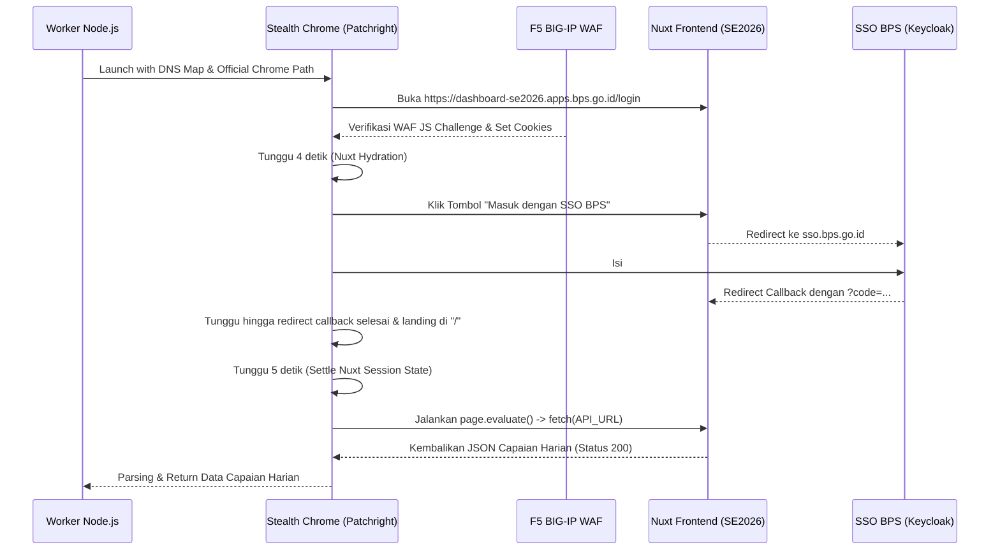

# Integrasi & Automasi Dashboard SE2026 (Sensus Ekonomi 2026)

Dokumen ini menjelaskan kendala, prasyarat, serta mekanisme teknis untuk mengotomasi penarikan data API dari Portal Monitoring Sensus Ekonomi 2026 (`https://dashboard-se2026.apps.bps.go.id`).

---

## 1. Kendala Utama & Mengapa Pemanggilan API Bisa Gagal

Selama proses riset dan pengujian, pemanggilan langsung ke API `https://dashboard-se2026.apps.bps.go.id/api/mikro/capaian-harian` seringkali gagal karena alasan berikut:

### A. Deteksi Bot oleh F5 BIG-IP WAF (HaloSIS)
* **Penyebab**: Aplikasi dilindungi oleh F5 BIG-IP WAF yang menyuntikkan client-side JavaScript challenge (`bobcmn`) pada request pertama.
* **Gejala**: Response HTTP 200/403 mengembalikan berkas HTML bertuliskan **"Bot Detected"** / *"Kami mendeteksi perilaku yang tidak wajar pada koneksi anda..."*.
* **Pemicu**: 
  * Menggunakan HTTP Client biasa (seperti Node native `fetch` / Axios) yang tidak mendukung engine JavaScript.
  * Menggunakan browser headless bawaan Playwright tanpa modifikasi stealth (terdeteksi flag `navigator.webdriver`).
  * Memalsukan header `sec-ch-ua` dengan versi browser fiktif (misal: Google Chrome versi `150`).

### B. Masalah DNS Resolution pada Koneksi VPN BPS
* **Penyebab**: Engine Chromium headless seringkali mengabaikan setelan DNS bawaan host OS ketika VPN BPS aktif.
* **Gejala**: Error `ERR_NAME_NOT_RESOLVED` saat mencoba membuka domain internal BPS.

### C. Kegagalan Exchange OAuth Rute `/callback` Nuxt.js
* **Penyebab**: Dashboard SE2026 berbasis **Nuxt.js**. Ketika SSO BPS Keycloak berhasil melakukan login, ia mengembalikan parameter `code` (authorization code) ke `https://dashboard-se2026.apps.bps.go.id/callback?code=...`.
* **Gejala**: Mendapatkan respon JSON `401 Unauthorized: Session tidak ditemukan` meskipun login SSO berhasil.
* **Pemicu**: Halaman callback ditutup atau dialihkan ke URL API secara langsung sebelum client-side JavaScript Nuxt selesai menukarkan kode tersebut ke backend untuk membuat sesi user yang aktif.

---

## 2. Prasyarat Sukses Automasi Penarikan Data (Preconditions)

Untuk memastikan penarikan data berhasil secara konsisten 100%, hal-hal berikut **wajib** dipenuhi:

1. **VPN BPS Aktif**: Host komputer harus terhubung ke VPN BPS agar alamat IP internal berikut dapat dijangkau.
2. **Kredensial `.env` Valid**: Kredensial SSO BPS (`FASIH_USERNAME` & `FASIH_PASSWORD`) harus dikonfigurasi dengan benar tanpa spasi tambahan.
3. **Menggunakan Local Chrome Binary**: Harus meluncurkan executable Google Chrome resmi (misalnya di Windows: `C:\Program Files\Google\Chrome\Application\chrome.exe`) bukan browser Chromium bawaan default Playwright.
4. **Stealth Engine (`patchright`)**: Menggunakan library browser stealth untuk mempatch flag otomasi di tingkat biner.

---

## 3. Alur Mekanisme Login SSO & Penarikan Data yang Benar

Sistem wajib mengikuti urutan langkah (sequence) berikut secara presisi:



### Penjelasan Teknis Langkah demi Langkah:

#### Langkah 1: DNS Mapping & Browser Stealth
Inisialisasi browser wajib memetakan alamat IP internal VPN BPS menggunakan parameter `--host-resolver-rules`:
```javascript
const hostIp = (await dns.promises.resolve4("dashboard-se2026.apps.bps.go.id"))[0];
const ssoIp = (await dns.promises.resolve4("sso.bps.go.id"))[0];

const args = [
  "--no-sandbox",
  "--ignore-certificate-errors",
  `--host-resolver-rules=MAP dashboard-se2026.apps.bps.go.id ${hostIp}, MAP sso.bps.go.id ${ssoIp}`,
];
```

#### Langkah 2: Membuka Login Page & Mendapatkan WAF Cookies
Navigasi awal harus diarahkan ke `https://dashboard-se2026.apps.bps.go.id/login`. Langkah ini krusial agar browser menerima cookie awal dari F5 WAF.
```javascript
await page.goto("https://dashboard-se2026.apps.bps.go.id/login", { waitUntil: "networkidle" });
await page.waitForTimeout(4000); // Menunggu hidrasi Nuxt selesai
```

#### Langkah 3: Eksekusi Klik SSO & Autentikasi Keycloak
Klik tombol SSO dan tunggu pengalihan halaman secara sempurna:
```javascript
const ssoBtn = page.getByRole("button", { name: /SSO BPS/i });
await ssoBtn.click();

await page.waitForURL((url) => url.hostname.includes("sso.bps.go.id"), { timeout: 30000 });
await page.waitForSelector("#username");
await page.fill("#username", process.env.FASIH_USERNAME);
await page.fill("#password", process.env.FASIH_PASSWORD);
await page.click("#kc-login");
```

#### Langkah 4: Penyelesaian Callback & Penarikan Data (Inner Fetch)
Biarkan browser menyelesaikan rute `/callback` dan mendarat di halaman utama dashboard secara alami, kemudian eksekusi API fetch di dalam tab browser:
```javascript
// Tunggu rute kembali dari /callback ke halaman utama /
await page.waitForURL((url) => url.hostname.includes("dashboard-se2026.apps.bps.go.id") && !url.pathname.includes("/callback"), { timeout: 30000 });
await page.waitForTimeout(5000); // Tunggu sesi tersimpan di client-state

// Jalankan fetch dari dalam context halaman
const result = await page.evaluate(async (apiUrl) => {
  const res = await fetch(apiUrl, { headers: { "accept": "*/*" } });
  return await res.json();
}, "https://dashboard-se2026.apps.bps.go.id/api/mikro/capaian-harian?kode_wilayah=6104");
```
