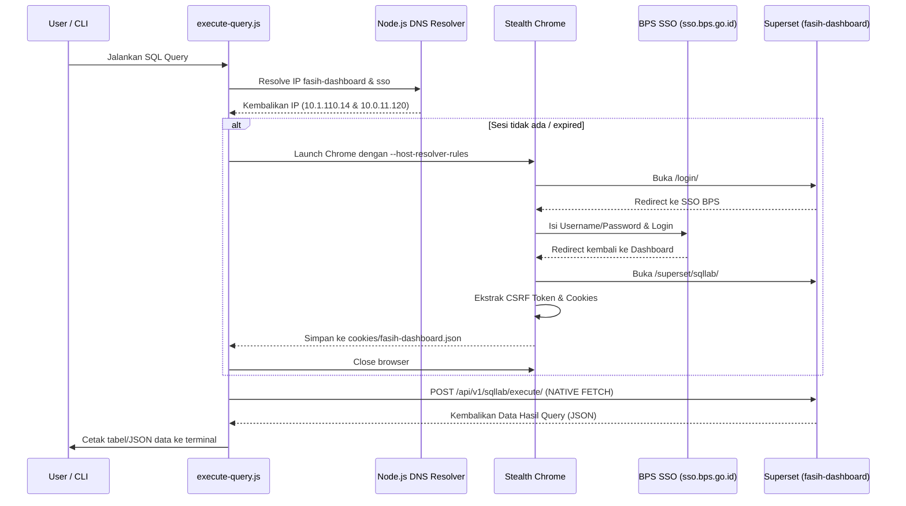

# Panduan Integrasi & Automasi Superset SQL Lab (Fasih Dashboard)

Dokumen ini mendokumentasikan analisis, kegagalan uji coba, serta solusi sukses untuk melakukan eksekusi query SQL secara terprogram pada **Fasih Dashboard (Superset SQL Lab)** melalui VPN BPS Mempawah.

---

## 1. Spesifikasi Target API & Halaman
* **Dashboard Base URL:** `https://fasih-dashboard.bps.go.id`
* **SQL Execution Endpoint:** `POST https://fasih-dashboard.bps.go.id/api/v1/sqllab/execute/`
* **SQL Lab Page (CSRF Source):** `https://fasih-dashboard.bps.go.id/superset/sqllab/`

---

## 2. Riwayat Eksplorasi (Temuan & Kegagalan)

### Masalah A: Host Not Resolved (`ERR_NAME_NOT_RESOLVED` di Linux)
* **Penyebab:** 
  Aplikasi VPN FortiClient di Linux menulis DNS internal BPS (`10.10.11.11`) langsung ke `/etc/resolv.conf`. Namun, Chromium (yang digunakan Playwright/Patchright) secara default me-bypass berkas ini dan menggunakan systemd-resolved (D-Bus) untuk resolusi nama. Akibatnya, host `fasih-dashboard.bps.go.id` dan `sso.bps.go.id` gagal ter-resolve di dalam browser Chromium headless.
* **Solusi Gagal:**
  * Mencoba mengakses via alamat IP langsung (menyebabkan sertifikat HTTPS SSL ditolak).
  * Menggunakan flag `--host-rules` (tidak didukung penuh di versi Chromium baru).
* **Solusi Berhasil:**
  Melakukan resolusi DNS secara lokal di sisi Node.js menggunakan module `dns` bawaan (`dns.promises.resolve4()`) yang mematuhi `/etc/resolv.conf`, lalu memetakan hasilnya secara dinamis ke parameter Chromium menggunakan flag:
  `--host-resolver-rules="MAP fasih-dashboard.bps.go.id <IP_DASHBOARD>, MAP sso.bps.go.id <IP_SSO>"`

### Masalah B: Hilangnya CSRF Token (`HTTP 400: CSRF token is missing`)
* **Penyebab:**
  Mengeposkan request POST query langsung menggunakan session cookie ditolak oleh Superset karena tidak menyertakan header token CSRF (`x-csrftoken`).
* **Solusi Berhasil:**
  Menavigasi browser ke halaman `https://fasih-dashboard.bps.go.id/superset/sqllab/` terlebih dahulu, lalu mengambil nilai token CSRF dari elemen input tersembunyi yang dirender oleh backend Flask/Superset:
  ```javascript
  const csrfToken = await page.evaluate(() => {
    return document.getElementById("csrf_token")?.value;
  });
  ```

### Masalah C: Gagal Membuat Query di DB (`HTTP 500: Create failed`)
* **Penyebab:**
  Mengirimkan payload POST query dengan parameter `client_id` statis (seperti `"IitUgdIWLv"` hasil sadapan browser) menyebabkan error `Create failed` di sisi server. Hal ini dikarenakan skema database Superset mewajibkan `client_id` bernilai unik untuk setiap riwayat eksekusi.
* **Solusi Berhasil:**
  Membuat string acak alfanumerik sepanjang 10 karakter secara dinamis untuk setiap request `client_id`:
  ```javascript
  const clientId = Math.random().toString(36).substring(2, 12);
  ```

### Masalah D: Request Gagal di Browser Sandbox (`TypeError: Failed to fetch`)
* **Penyebab:**
  Melakukan eksekusi fetch HTTP di dalam konteks evaluasi halaman browser (`page.evaluate`) diblokir karena adanya restriksi sertifikat TLS untrusted dan limitasi sandbox browser.
* **Solusi Berhasil:**
  Menggunakan browser Playwright *hanya* untuk login SSO dan ekstraksi token CSRF + Cookies. Setelah itu, browser langsung ditutup dan request HTTP POST dijalankan secara native dari konteks Node.js menggunakan `fetch` bawaan dengan flag `NODE_TLS_REJECT_UNAUTHORIZED=0`.

---

## 3. Alur Kerja Script `src/execute-query.js` yang Berhasil



---

## 4. Cara Menjalankan
Pastikan berkas kredensial SSO BPS pada `.env` sudah sesuai, kemudian jalankan:
```bash
node src/execute-query.js "SELECT kategori, COUNT(*) FROM tgr_fd68e454.se2026_nested GROUP BY kategori"
```
Sesi login akan disimpan secara otomatis di folder `cookies/` untuk digunakan kembali pada eksekusi berikutnya secara instan (tanpa spawning browser ulang), kecuali jika sesi sudah kedaluwarsa, yang mana script akan melakukan re-login otomatis.
